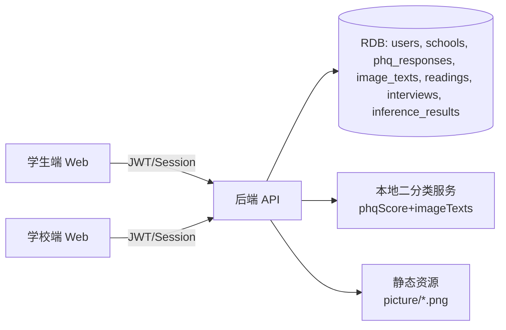

# 技术方案设计

## 架构概览
前端：React 18 + TS + Vite + MUI 单页应用，使用 Axios `/api/*` 封装与 Redux Toolkit 管理状态；MSW 继续用于占位与离线演示。  
后端：REST API（Node.js + Express + TypeScript，与现有集成指南一致），面向学校端与学生端，提供认证、PHQ-9、CAPS 文本提交、阅读与访谈记录、本地推理占位接口。  
存储：关系型数据库（MySQL/PostgreSQL）记录用户、学校、量表答案、图片文本、阅读记录、访谈回答、推理结果；图片可本地静态目录或对象存储。  
推理：本地二分类模型服务（Python FastAPI/Flask）通过内部 HTTP 调用；不可用时由 API 返回静态示例。

## 技术选型
- 前端：React + TypeScript + Vite + MUI，Redux Toolkit 管理问卷/任务状态，Axios 统一错误处理并附带 `X-Session-Id`；MSW Mock（与现有前端一致）。
- 认证：JWT（HS256）或服务端 Session，前端存储 token；学校端角色 `school_admin` 授权。
- 后端：Node.js + Express + TypeScript，需要 multipart 支持（后续扩展录制上传），保持与现有后端联调指南的 REST 风格一致。
- 推理：Python FastAPI/Flask `POST /internal/inference/local-binary`，同机部署，超时 5s，返回 {label, summary, confidence}。

## 数据与接口设计
### 数据表（示例字段）
- `users`: id, name, phone/student_id, password_hash, role(student|school_admin), school_id, class_name, created_at.
- `schools`: id, name, region, created_at.
- `phq_responses`: id, user_id, total_score, severity, profile(json: name, ageRange, gender, history, diagnosisTime, diagnosisId, note), answers(json), dwell_times(json), submitted_at.
- `image_texts`: id, user_id, image_id, category(negative|neutral|positive), content, submitted_at.
- `reading_records`: id, user_id, passages(json array of ids), completed_at.
- `interview_answers`: id, user_id, question_id, category(A|B|C), content, submitted_at.
- `inference_results`: id, user_id, phq_score, label, summary, confidence, status(success|fallback), created_at.

### API 契约（新增/改造）
- `POST /api/auth/register` body {phone/studentId, password, name, schoolId, className, role?student} -> {token}.
- `POST /api/auth/login` -> {token}.
- `GET /api/school/dashboard?schoolId&className&from&to` -> {userCount, completionRate, severityBuckets, riskBuckets}.
- `POST /api/phq9` body {profile:{name, ageRange, gender, history, diagnosisTime, diagnosisId, note?}, answers[], dwellTimes[]} -> {score, severity, summaryText}.
- `GET /api/pictures` -> {list:[{id, url, category}]}（可直接读取静态目录，接口用于分类提示）。
- `POST /api/pictures/text` body {imageId, content} -> {success:true}.
- `GET /api/readings` -> {pool:[{id, title, content}]}；前端在 6 篇候选中随机抽 2 篇并回传记录。
- `POST /api/readings/record` body {passageIds: number[]} -> {success:true}.
- `GET /api/interview/questions?category=A|B|C&count=1` -> {questions:[{id, content}]}。
- `POST /api/interview/answers` body {questionId, category, content} -> {success:true}.
- `POST /api/inference/local-binary` body {phqScore, imageTexts:[{imageId, content}], userProfile:{ageRange,gender,occupation}} -> {label, summary, confidence}，失败返回 fallback 示例。

## 页面与交互
- 登录/注册页：表单 + 验证码占位；登录态失效统一跳转。
- 学生端
  - `/scale`: 个人信息（姓名/性别/年龄段/病史/确诊时间/编号/备注可选）+ 9 题 PHQ-9；提交后显示分数、严重程度、静态心理状态描述。
  - `/visual-narrative`: 负/中/正各抽 1 张（101-110/201-210/301-310），逐张输入 1-3 句文本；类别提示与本地暂存。
  - `/reading`: 从 6 篇候选随机 2 篇，展示标题+正文，点击“已读完”进入下一步并记录编号。
  - `/interview`: 顺序出题 A→B→C 各 1 题，输入文本提交；支持离线暂存。
  - `/report`: 展示 phq 分数、推理标签、summary；推理接口异常时标记“示例”。触发条件：完成量表+3 张图片描述+2 篇短文+3 道访谈。
- 学校端
  - `/school/dashboard`: 过滤器（学校、班级、时间），卡片/表格展示总量与分布，导出 CSV。

## 测试策略
- 单元：PHQ-9 评分与严重度映射、静态文案选择、图片分类映射、阅读/访谈抽题逻辑、接口请求构造。
- 集成：登录/授权流；提交问卷后数据库写入；图片文本提交与本地暂存；阅读记录存储；访谈答案提交；推理接口调用超时/失败兜底。
- Mock：MSW 覆盖上述接口，包含 fallback 文案路径。
- 手工/验收：按 ERAS 场景回归；学校端过滤与导出；弱网/离线本地暂存提示。

## 安全性与隐私
- 全程 HTTPS；密码用 bcrypt 存储，最小化敏感字段留存。
- 基于角色的访问控制：学校端接口需 `school_admin`；学生仅访问自身记录。
- 输入校验与速率限制：登录、提交接口限流；防止重复提交与批量写入。
- 数据隔离与脱敏：学校维度隔离查询；日志不记录明文答案。
